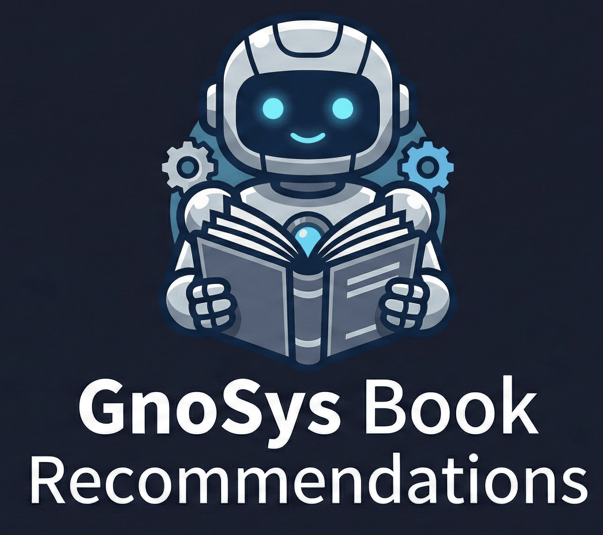

# GnoSys: Hybrid Book Recommendation System & AI Assistant

  

## 🎓 About this Project
**GnoSys** is the result of my **Undergraduate Thesis**. It is a book discovery platform that integrates traditional recommendation techniques with cutting-edge Generative AI.

The primary objective of this thesis was to develop a hybrid recommendation engine that overcomes the limitations of single-model systems, providing a personalized, interactive, and context-aware experience for the user.

## 🚀 Key Features
* **Hybrid Recommendation Engine**: Combines **Collaborative Filtering** (SVD Matrix Factorization) and **Content-Based Filtering** (TF-IDF) to deliver high-accuracy suggestions.
* **AI Librarian**: An integrated **GPT-4o-mini** powered assistant that acts as a digital librarian, capable of understanding natural language queries and providing Greek-aware book discussions.
* **Interactive Dashboard**: A fully functional web interface built with **Streamlit** for seamless user interaction.
* **Model Evaluation**: Built-in scripts for performance benchmarking using metrics such as RMSE and MAE.

## 📂 Project Structure & File Descriptions

| File | Description |
| :--- | :--- |
| **main_app.py** | The main entry point of the application and Streamlit UI management. |
| **models.py** | The core logic containing the implementations of SVD and Content-Based algorithms. |
| **ai_assistant.py** | Handles the communication with the OpenAI API for the AI Librarian features. |
| **data_preparation.py** | Data cleaning, preprocessing pipelines, and cache management. |
| **utils.py** | Utility functions for configuration loading and resource management. |
| **config_sample.json** | Configuration template (rename to `config.json` and add your API key). |

## 🛠️ Tech Stack
* **Language**: Python 3.x
* **Machine Learning**: Pandas, Scikit-learn, Surprise
* **Artificial Intelligence**: OpenAI API (GPT Models)
* **Frontend**: Streamlit
* **Data Handling**: JSON-based configuration and Pickle for model serialization.

---
*Developed as part of my Undergraduate Thesis.*

